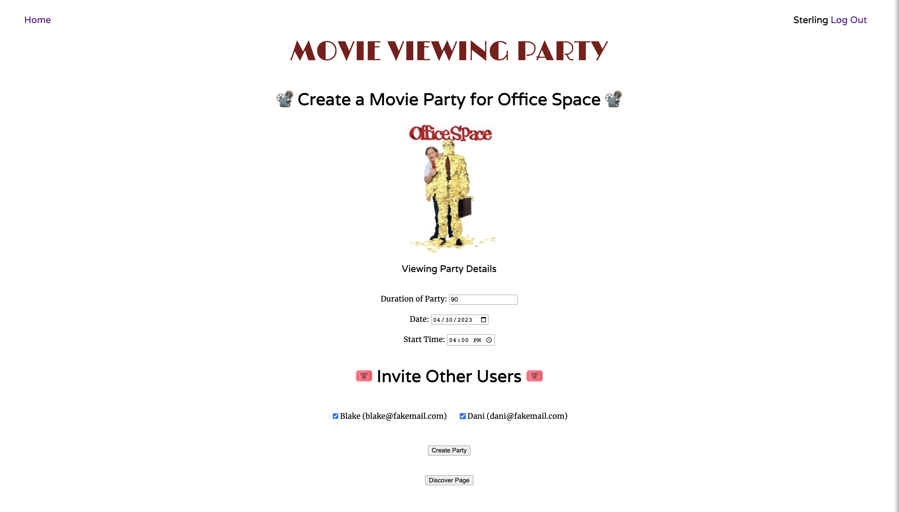
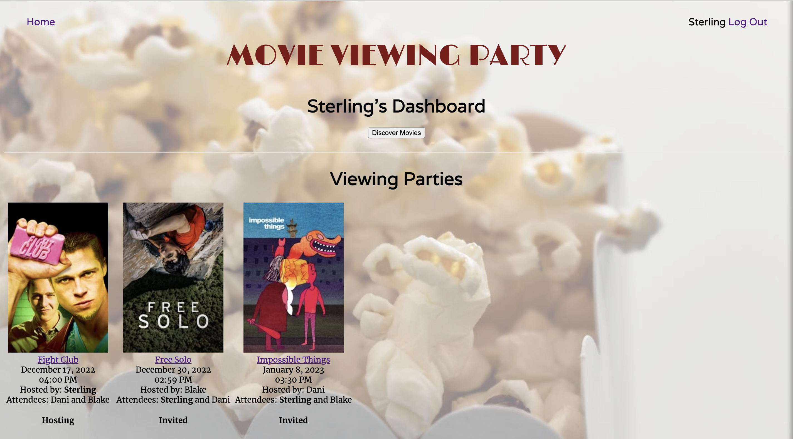

<a name="readme-top"></a>

<div align="right">

[](https://github.com/AMSterling/viewing_party_lite)
[](https://codeclimate.com/github/AMSterling/viewing_party_lite/maintainability)
[](https://github.com/AMSterling/viewing_party_lite/actions/workflows/rubyonrails.yml)

</div>

[![Contributors][contributors-shield]][contributors-url]
[![Forks][forks-shield]][forks-url]
[![Stargazers][stars-shield]][stars-url]
[![Issues][issues-shield]][issues-url]
[![Sterling][LinkedIn]][LinkedIn-url]
[![Saylor][LinkedIn2]][LinkedIn2-url]


<!-- PROJECT LOGO -->
<br/>
<div align="center">

  <h1 align="center">Viewing Party Lite</h1>

  <a href="https://github.com/AMSterling/viewing_party_lite">
    
  </a>

  <p>
    Viewing Party Lite is an application in which users can explore movie options and create
    a viewing party event for themselves and other users of the application.
    <!-- <br />
    <a href="https://github.com/AMSterling/viewing_party_lite"><strong>Explore the docs »</strong></a>
    <br />
    <br />
    <a href="https://github.com/AMSterling/viewing_party_lite">View Demo</a>
    ·
    <a href="https://github.com/AMSterling/viewing_party_lite/issues">Report Bug</a>
    ·
    <a href="https://github.com/AMSterling/viewing_party_lite/issues">Request Feature</a> -->
  </p>

</div>


<!-- TABLE OF CONTENTS -->
<details>
  <summary>Table of Contents</summary>
  <ol>
    <li>
      <a href="#about-the-project">About The Project</a>
      <ul>
        <li><a href="#built-with">Built With</a></li>
      </ul>
    </li>
    <li>
      <a href="#getting-started">Getting Started</a>
      <ul>
        <li><a href="#prerequisites">Prerequisites</a></li>
        <li><a href="#installation">Installation</a></li>
      </ul>
    </li>
    <li><a href="#usage">Usage</a></li>
    <li><a href="#acknowledgments">Acknowledgments</a></li>
  </ol>
</details>


<!-- ABOUT THE PROJECT -->
## About The Project

App is deployed [here](https://viewing-party-22.herokuapp.com/)

_Home/Create Account/Login/User Index_
# 


_Create Viewing Party_
# 


_User Dashboard_
# 

_Example wireframes are found [here](https://backend.turing.edu/module3/projects/viewing_party_lite/wireframes)_

---
<p align="right">(<a href="#readme-top">back to top</a>)</p>


<!-- BUILT WITH -->
### Built With

<div align="center">

  <p>

[![Rails][Rails]][Rails-url] [![Ruby][Ruby]][Ruby-url] [![RSpec][RSpec]][RSpec-url] [![Atom][Atom]][Atom-url] [![Visual Studio Code][Visual Studio Code]][Visual Studio Code-url] [![Heroku][Heroku]][Heroku-url] [![GitHub Actions][GitHub Actions]][GitHub Actions-url]
  </p>

  <p>

[![CodeClimate][CodeClimate]][CodeClimate-url] [![CSS][CSS]][CSS-url] [![HTML5][HTML5]][HTML5-url] [![JavaScript][JavaScript]][JavaScript-url] [![PostgreSQL][PostgreSQL]][PostgreSQL-url] [![jQuery][jQuery]][jQuery-url] [![RuboCop][RuboCop]][RuboCop-url]

  </p>

</div>

---
<p align="right">(<a href="#readme-top">back to top</a>)</p>


<!-- GETTING STARTED -->
## Getting Started

Follow installation instructions below. Push to your preferred production server or in your terminal run
  ```sh
  rails server
  ```
Then open [http://localhost:3000](http://localhost:3000) in your browser.

---
<p align="right">(<a href="#readme-top">back to top</a>)</p>


<!-- PREREQUISITES -->
### Prerequisites

Ruby:
  ```sh
  3.1.1
  ```
Rails:
  ```sh
  7.0.4
  ```
Database:
  ```sh
  postgresql@14
  ```
---
<p align="right">(<a href="#readme-top">back to top</a>)</p>


<!-- INSTALLATION -->
### Installation

1. Get a free API Key at [TMDB](https://www.themoviedb.org/settings/api)
2. Clone the repo
   ```sh
   git clone https://github.com/AMSterling/viewing_party_lite.git
   ```
3. Install gem packages
   ```sh
   rails db:{drop,create,migrate}
   bundle install
   bundle exec figaro install
   bundle update
   ```
4. Enter your API in `config/application.yml`
   ```js
   movie_api_key: 'ENTER YOUR API'
   ```
_A full list of gems that will be installed can be found in the [gemfile][gemfile-url]._

---
<p align="right">(<a href="#readme-top">back to top</a>)</p>

<!-- USAGE EXAMPLES -->
## Usage

Create Movie Viewing Parties with friends. Search movies from [The Movie Database](https://www.themoviedb.org), select a day, time, and invite other users.

<div align="center">

  <a href="https://github.com/AMSterling/viewing_party_lite">
    
  </a>

</div>

_For more examples, please refer to the [Documentation](https://backend.turing.edu/module3/projects/viewing_party_lite/)_

---
<p align="right">(<a href="#readme-top">back to top</a>)</p>

<!-- ACKNOWLEDGMENTS -->
## Acknowledgments

* [![AMSterling][GitHub Badge]](https://github.com/AMSterling)
* [![blakesaylor][GitHub-Saylor]](https://github.com/blakesaylor)
* [![Turing][Turing]][Turing-url]

---
<p align="right">(<a href="#readme-top">back to top</a>)</p>

<!-- MARKDOWN LINKS & IMAGES -->
<!-- https://www.markdownguide.org/basic-syntax/#reference-style-links -->
[contributors-shield]: https://img.shields.io/github/contributors/AMSterling/viewing_party_lite.svg?style=for-the-badge
[contributors-url]: https://github.com/AMSterling/viewing_party_lite/graphs/contributors
[forks-shield]: https://img.shields.io/github/forks/AMSterling/viewing_party_lite.svg?style=for-the-badge
[forks-url]: https://github.com/AMSterling/viewing_party_lite/network/members
[gemfile-url]: https://github.com/AMSterling/viewing_party_lite/blob/main/Gemfile
[stars-shield]: https://img.shields.io/github/stars/AMSterling/viewing_party_lite.svg?style=for-the-badge
[stars-url]: https://github.com/AMSterling/viewing_party_lite/stargazers
[issues-shield]: https://img.shields.io/github/issues/AMSterling/viewing_party_lite.svg?style=for-the-badge
[issues-url]: https://github.com/AMSterling/viewing_party_lite/issues
[license-shield]: https://img.shields.io/github/license/AMSterling/viewing_party_lite.svg?style=for-the-badge
[license-url]: https://github.com/AMSterling/viewing_party_lite/blob/master/LICENSE.txt
[LinkedIn]: https://img.shields.io/badge/-Sterling-black.svg?style=for-the-badge&logo=linkedin&colorB=555
[LinkedIn-url]: https://linkedin.com/in/sterling-316a6223a/

[Atom]: https://img.shields.io/badge/Atom-66595C?style=for-the-badge&logo=Atom&logoColor=white
[Atom-url]: https://github.com/atom/atom/releases/tag/v1.60.0

[Bootstrap]: https://img.shields.io/badge/bootstrap-%23563D7C.svg?style=for-the-badge&logo=bootstrap&logoColor=white
[Bootstrap-url]: https://getbootstrap.com/

[Capybara]: https://custom-icon-badges.demolab.com/badge/Capybara-F7F4EF?style=for-the-badge&logo=capybara
[Capybara-url]: https://www.patreon.com/capybara

[CircleCI]: https://img.shields.io/badge/circle%20ci-%23161616.svg?style=for-the-badge&logo=circleci&logoColor=white
[CircleCI-url]: https://circleci.com/developer

[Code Climate]: https://img.shields.io/badge/Code%20Climate-000?logo=codeclimate&logoColor=fff
[CodeClimate]: https://img.shields.io/badge/Code%20Climate-000?style=for-the-badge&logo=codeclimate&logoColor=fff
[CodeClimate-url]: https://codeclimate.com

[CSS]: https://img.shields.io/badge/CSS-239120?&style=for-the-badge&logo=css3&logoColor=white
[CSS-url]: https://en.wikipedia.org/wiki/CSS

[Fly]: https://custom-icon-badges.demolab.com/badge/Fly-DCDCDC?style=for-the-badge&logo=fly-io
[Fly-url]: https://fly.io/

[Git]: https://img.shields.io/badge/GIT-E44C30?style=for-the-badge&logo=git&logoColor=white
[Git-url]: https://git-scm.com/

[GitHub Badge]: https://img.shields.io/badge/AMSterling-100000?style=for-the-badge&logo=github&logoColor=white
[GitHub-Saylor]: https://img.shields.io/badge/blakesaylor-100000?style=for-the-badge&logo=github&logoColor=white
[GitHub-url]: https://github.com/enter_url/

[GitHub Actions]: https://img.shields.io/badge/github%20actions-%232671E5.svg?style=for-the-badge&logo=githubactions&logoColor=white
[GitHub Actions-url]: https://github.com/features/actions

[GraphQL]: https://img.shields.io/badge/-GraphQL-E10098?style=for-the-badge&logo=graphql&logoColor=white
[GraphQL-url]: https://graphql.org/

[Heroku]: https://img.shields.io/badge/Heroku-430098?style=for-the-badge&logo=heroku&logoColor=white
[Heroku-url]: https://www.heroku.com/

[Homebrew]: https://custom-icon-badges.demolab.com/badge/Homebrew-2e2a24?style=for-the-badge&logo=homebrew_logo
[Homebrew-url]: https://brew.sh/

[HTML5]: https://img.shields.io/badge/html5-%23E34F26.svg?style=for-the-badge&logo=html5&logoColor=white
[HTML5-url]: https://en.wikipedia.org/wiki/HTML5

[JavaScript]: https://img.shields.io/badge/javascript-%23323330.svg?style=for-the-badge&logo=javascript&logoColor=%23F7DF1E
[JavaScript-url]: https://www.javascript.com/

[jQuery]: https://img.shields.io/badge/jquery-%230769AD.svg?style=for-the-badge&logo=jquery&logoColor=white
[jQuery-url]: https://github.com/rails/jquery-rails

[LinkedIn2]: https://img.shields.io/badge/B.Saylor-0077B5?style=for-the-badge&logo=linkedin&logoColor=white
[LinkedIn2-url]: https://www.linkedin.com/in/blake-saylor/

[MacOS]: https://img.shields.io/badge/mac%20os-000000?style=for-the-badge&logo=macos&logoColor=F0F0F0
[MacOS-url]: https://www.apple.com/macos

[Miro]: https://img.shields.io/badge/Miro-050038?style=for-the-badge&logo=Miro&logoColor=white
[Miro-url]: https://miro.com/

[Postgres]: https://img.shields.io/badge/postgres-%23316192.svg?style=for-the-badge&logo=postgresql&logoColor=white
[Postgres-url]: https://www.postgresql.org/

[PostgreSQL]: https://img.shields.io/badge/PostgreSQL-316192?style=for-the-badge&logo=postgresql&logoColor=white
[PostgreSQL-url]: https://www.postgresql.org/

[Postman]: https://img.shields.io/badge/Postman-FF6C37?style=for-the-badge&logo=postman&logoColor=white
[Postman-url]: https://web.postman.co/

[Rails]: https://img.shields.io/badge/rails-%23CC0000.svg?style=for-the-badge&logo=ruby-on-rails&logoColor=white
[Rails-url]: https://rubyonrails.org/

[Redis]: https://img.shields.io/badge/redis-%23DD0031.svg?&style=for-the-badge&logo=redis&logoColor=white
[Redis-url]: https://redis.io/

[Replit]: https://img.shields.io/badge/replit-667881?style=for-the-badge&logo=replit&logoColor=white
[Replit-url]: https://replit.com/

[ror]: https://img.shields.io/badge/Ruby_on_Rails-CC0000?style=for-the-badge&logo=ruby-on-rails&logoColor=white
[ror-url]: https://rubyonrails.org/

[RSpec]: https://custom-icon-badges.demolab.com/badge/RSpec-fffcf7?style=for-the-badge&logo=rspec
[RSpec-url]: https://rspec.info/

[RuboCop]: https://img.shields.io/badge/RuboCop-000?logo=rubocop&logoColor=fff&style=for-the-badge
[RuboCop-url]: https://docs.rubocop.org/rubocop-rails/index.html

[Ruby]: https://img.shields.io/badge/Ruby-000000?style=for-the-badge&logo=ruby&logoColor=CC342D
[Ruby-url]: https://www.ruby-lang.org/en/

[Slack]: https://img.shields.io/badge/Slack-4A154B?style=for-the-badge&logo=slack&logoColor=white
[Slack-url]: https://slack.com/trials?remote_promo=f4d95f0b&utm_medium=ppc&utm_source=google&utm_campaign=ppc_google_amer_en_brand_selfserve_discount&utm_term=Slack_Exact_._slack_._e_._c&utm_content=611662283461&gclid=Cj0KCQiA54KfBhCKARIsAJzSrdptOf7OUrgfeH0CWCC7LaOjR8arXoBnBMZjUSTJqmzTKvH6Jh-YXzAaAjfWEALw_wcB&gclsrc=aw.ds

[Tailwind]: https://img.shields.io/badge/tailwindcss-%2338B2AC.svg?style=for-the-badge&logo=tailwind-css&logoColor=white
[Tailwind-url]: https://tailwindcss.com/

[Turing]: https://custom-icon-badges.demolab.com/badge/Turing-DCDCDC?style=for-the-badge&logo=turing_school
[Turing-url]: https://turing.edu/

[Visual Studio Code]: https://img.shields.io/badge/Visual%20Studio%20Code-0078d7.svg?style=for-the-badge&logo=visual-studio-code&logoColor=white
[Visual Studio Code-url]: https://code.visualstudio.com/

[XCode]: https://img.shields.io/badge/Xcode-007ACC?style=for-the-badge&logo=Xcode&logoColor=white
[XCode-url]: https://developer.apple.com/xcode/

[Zoom]: https://img.shields.io/badge/Zoom-2D8CFF?style=for-the-badge&logo=zoom&logoColor=white
[Zoom-url]: https://zoom.us/

[bcrypt-docs]: https://github.com/bcrypt-ruby/bcrypt-ruby
[capybara-docs]: https://github.com/teamcapybara/capybara
[factory_bot_rails-docs]: https://github.com/thoughtbot/factory_bot_rails
[faker-docs]: https://github.com/faker-ruby/faker
[faraday-docs]: https://lostisland.github.io/faraday/
[figaro-docs]: https://github.com/laserlemon/figaro
[jsonapi-serializer-docs]: https://github.com/jsonapi-serializer/jsonapi-serializer
[launchy-docs]: https://www.rubydoc.info/gems/launchy/2.2.0
[omniauth-google-oauth2-docs]: https://github.com/zquestz/omniauth-google-oauth2
[orderly-docs]: https://github.com/jmondo/orderly
[pry-docs]: https://github.com/pry/pry
[rspec-rails-docs]: https://github.com/rspec/rspec-rails
[shoulda-matchers-docs]: https://github.com/thoughtbot/shoulda-matchers
[simplecov-docs]: https://github.com/simplecov-ruby/simplecov
[vcr-docs]: https://github.com/vcr/vcr
[webmock-docs]: https://github.com/bblimke/webmock
